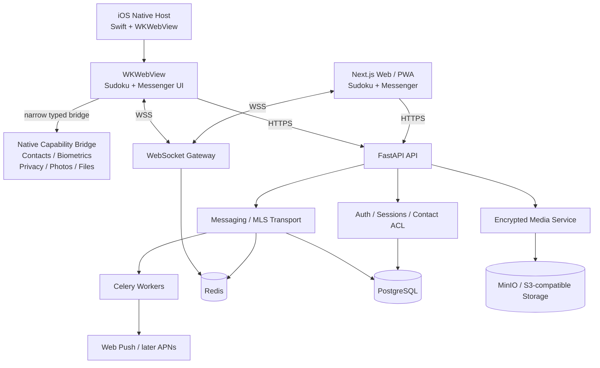

# Architecture

## Goal

Build a private invite-only messenger presented as **Sudoku**.

The product now has two client surfaces:

- **Web/PWA** — the current Next.js client remains supported;
- **Native iOS** — a thin native host adds capabilities Safari/PWA cannot provide reliably, while reusing the same Sudoku/Messenger UI, backend and MLS protocol.

Normal launch is always a genuine Sudoku game. A deliberate hidden gesture reveals the private messenger, but concealment is never treated as an authorization boundary.

## System architecture

## Client boundaries

### Shared web application

The Next.js application owns:

- Sudoku game and hidden reveal interaction;
- phone/password login;
- device PIN;
- conversation UI;
- MLS state machine and ciphertext creation;
- encrypted attachment metadata/keys;
- contact sync API calls;
- message outbox/retry logic;
- browser/PWA fallbacks.

### Native iOS host

The native host is a **first-party Swift/UIKit capability layer**, not a second messaging implementation. It uses a persistent `WKWebView` for the existing production origin so Secure/HttpOnly cookies, relative API calls, IndexedDB MLS state and WebSocket behavior remain on the same origin.

Allowed native capabilities are intentionally narrow:

- explicit system contact selection;
- Face ID / Touch ID via LocalAuthentication;
- synchronous privacy cover when the app leaves the foreground;
- Photos picker;
- document picker;
- later, APNs registration.

The bridge must not expose:

- arbitrary filesystem access;
- arbitrary native method execution;
- unrestricted address-book dumps;
- plaintext message/attachment upload;
- arbitrary navigation outside approved application origins.

The initial native host intentionally has no third-party runtime SDK dependency. The Xcode project is generated reproducibly from `ios/Sudoku/project.yml` with XcodeGen, while runtime behavior stays in first-party Swift.

### Security ownership

- Server authorization remains authoritative for sessions, invites, contacts and membership.
- MLS remains authoritative for private message/group cryptography.
- Native biometrics only unlock local UI state; they do not create or extend a server session.
- Sudoku concealment remains presentation privacy, not authentication.

## Identity and administration

Production is phone-first and invite-only.

- New accounts are phone-bound.
- Contact discovery exposes only registered, active, verified phone identities.
- Direct/group creation and direct sends are checked against the contact graph.
- There may be **at most one global administrator**.
- Only the singleton global administrator may create or revoke account invitations.
- Conversation-local `owner` roles do not grant global administration.

The singleton-admin invariant is enforced in the database as well as API authorization.

## Contacts architecture

The backend stores only matched relationships:

`owner_user_id -> contact_user_id`

It does not store the complete phone book or unmatched numbers.

Client behavior:

- iOS native: system picker returns only explicitly selected contacts;
- browsers with Contact Picker: same explicit-selection model;
- unsupported browsers/PWA: manual E.164 entry.

All three paths converge on the same `/v1/contacts/sync` API and therefore share the same authorization semantics.

## Reliability defaults

- PostgreSQL is authoritative for users, sessions, memberships, messages, receipts, contact edges and audit history.
- Redis is ephemeral: presence, fan-out, rate limits and Celery coordination.
- Message creation uses `client_id` idempotency and a transactional outbox.
- Clients maintain a durable local outbox for reconnect/retry.
- Transient send failures may retry automatically; permanent failures must become explicit user-visible failed states.
- Assets are immutable ciphertext objects addressed by internal storage keys; signed URLs are generated on demand.

Target message state model for the native-quality pass:

`queued -> encrypting -> sending -> sent -> delivered/read`

with explicit `failed_transient` and `failed_permanent` states.

## Privacy lifecycle

- `SudokuShell` is always safe to display.
- `MessengerShell` requires both the hidden gesture and valid authenticated state.
- Web/PWA uses the existing synchronous privacy cover.
- Native iOS additionally owns an OS-level/app-window privacy cover so the app switcher never snapshots chat content.
- Returning after the configured background interval restores Sudoku before private content is shown.

## Deployment principle

The backend stays containerized and provider-portable:

- FastAPI;
- PostgreSQL;
- Redis;
- Celery;
- MinIO/S3-compatible storage;
- Caddy.

The iOS app is a separate release artifact. Server and iOS releases are versioned and verified independently but must declare compatibility with the same API/MLS contract.

## Observability

- FastAPI, SQLAlchemy, Redis and Celery emit OpenTelemetry telemetry.
- OTLP/HTTP export is enabled only when configured.
- Application logs are structured and correlate to active trace/span IDs.
- Chat/message bodies, credentials, session material and decrypted attachment data are not logged.
- Native iOS diagnostics must follow the same rule: no phone-book dump, message plaintext, MLS secrets or attachment plaintext in logs/crash metadata.

## Cross-platform UX parity

Sudoku Messenger uses one product contract across iOS, Android/PWA and desktop/browser. Native bridges are implementation details, not separate UX specifications. Gesture semantics, conceal/reveal behavior, PIN and Messenger flows, contact/chat behavior and private-surface lifecycle must remain equivalent across supported clients. OS-specific APIs may be used to achieve the same result. For background/task-switcher privacy, clients must conceal Messenger and present the last available real Sudoku state before the operating system captures a preview whenever the platform exposes enough lifecycle control.

### Retained Sudoku privacy surface

The web/PWA shell keeps the current Sudoku screen mounted underneath private Messenger content. While Messenger is active, Sudoku is inert and its gameplay clock is paused. On `visibilitychange(hidden)` or `pagehide`, a synchronous CSS privacy shield hides the private layer and raises the retained real Sudoku state for browser/OS task-preview capture. The decorative privacy grid is fallback-only before a usable Sudoku state has hydrated. Native iOS additionally caches a UIKit image of the same Sudoku state for App Switcher protection.
