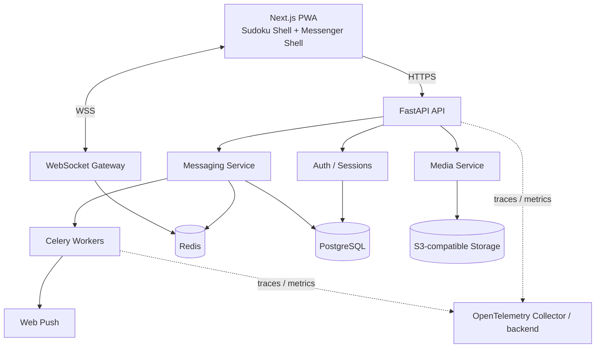

# Architecture

## Goal

Build a private invite-only mobile-first messenger delivered as an installable PWA named **Sudoku**. The normal launch experience is a genuine Sudoku game. A deliberate hidden gesture opens the messenger surface, but concealment is never treated as an authorization boundary.

## System architecture

## Client boundaries

- `SudokuShell`: always safe to display, including app launch and app-switcher return.
- `MessengerShell`: rendered only after both the hidden gesture and a valid authenticated session.
- `SecretUnlock`: UI-only state machine. It grants no server capability.
- App backgrounding for more than 30 seconds forces the visible shell back to Sudoku.

## Reliability defaults

- PostgreSQL is authoritative for users, memberships, messages, receipts, and audit history.
- Redis is ephemeral: presence, fan-out, rate-limit counters, Celery broker state.
- Message creation uses an idempotency key (`client_id`) and a transactional outbox.
- Clients keep an IndexedDB outbox for offline sends and reconnect retries.
- Assets are immutable objects addressed by internal storage keys; signed URLs are generated on demand.

## Deployment principle

No hard dependency on Firebase, Supabase, or Vercel-specific data services. The application must remain deployable with containers on ordinary Linux infrastructure and portable S3/PostgreSQL/Redis providers.

## Observability

- FastAPI, SQLAlchemy, Redis and Celery emit OpenTelemetry telemetry.
- OTLP/HTTP export is enabled only when `OTEL_EXPORTER_OTLP_ENDPOINT` is configured.
- Application logs are structured JSON and correlate to active trace/span IDs.
- Chat/message bodies, auth credentials and private headers are not logged.
- Business metric dimensions are bounded and never include user/message/conversation IDs.
- Health/readiness polling is excluded from routine traces/access metrics to control cost and noise.
