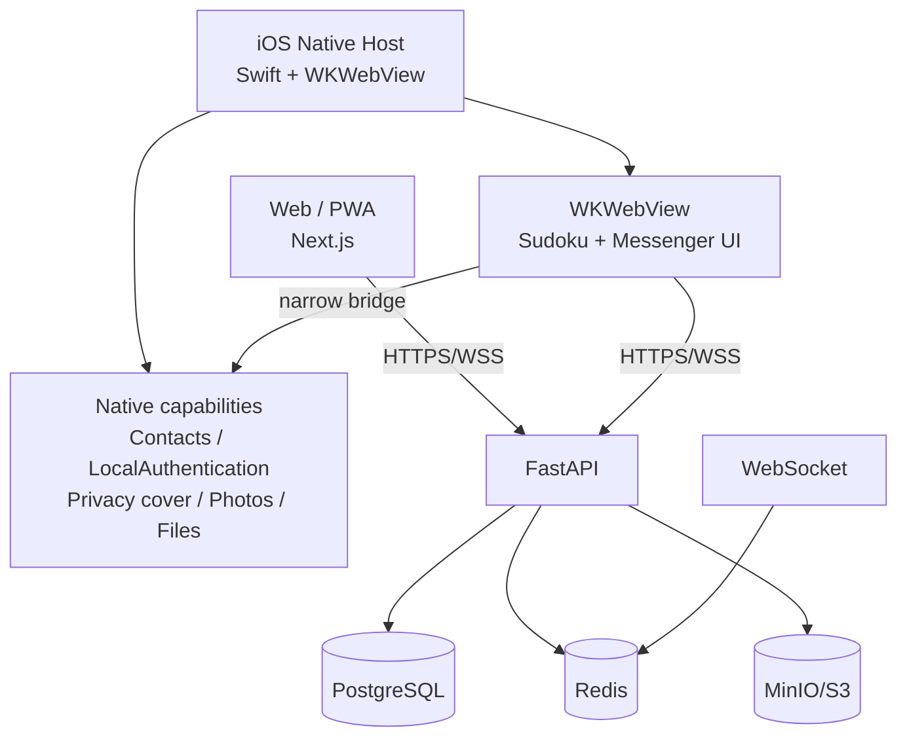

# Step 88 — Native iOS production plan

Date: 2026-09-23.

## Goal

Evolve Sudoku Messenger from a PWA-only product into a dual-client product:

- the existing web/PWA remains supported;
- Android stays on the current Web/PWA client for this production cycle;
- iPhone gets a real native container with native contacts, biometric unlock, privacy shielding, media/file pickers and later native push;
- the existing FastAPI/PostgreSQL/Redis/MinIO backend and MLS E2EE protocol remain the source of truth;
- the Sudoku disguise/hidden-entry UX remains intact;
- production stays invite-only and has exactly one global administrator.

This is a product hardening program, not a rewrite. Native Android is explicitly out of scope unless later Android/PWA QA exposes a platform limitation that materially requires it.

## Product rules

1. **Exactly one global administrator**
   - only the singleton admin may create or revoke account invites;
   - invited members are never global admins;
   - group-owner roles remain conversation-local and do not grant global invite privileges;
   - the database must reject creation of a second global admin.

2. **Contacts define who can be discovered and messaged**
   - the server still stores only matched registered-user edges;
   - the native iOS client must not silently upload the whole address book;
   - the preferred iOS UX is an explicit system contact picker that returns only contacts the user chose;
   - manual E.164 entry remains the fallback on web/PWA and on native failure.

3. **Native shell is a capability layer, not a new security authority**
   - session, membership, contact ACL and MLS authorization remain server/client-protocol enforced;
   - Face ID/Touch ID is a local convenience/privacy gate and never replaces server authentication;
   - native code must never receive decrypted message history unless a feature actually requires it.

4. **No protocol fork**
   - native iOS and web/PWA use the same HTTP/WebSocket API and the same MLS message/control formats;
   - no native-only plaintext fallback is allowed.

## Architecture target

The first iOS candidate uses a small first-party Swift host with a persistent `WKWebView` pointed at the verified production origin. This preserves the current same-origin Secure/HttpOnly cookie, relative `/v1` API calls, IndexedDB/MLS state and WebSocket behavior without introducing a second native auth protocol. Navigation is constrained with `WKAppBoundDomains`, `limitsNavigationsToAppBoundDomains` and an explicit navigation delegate. We intentionally do not use Capacitor `server.url` for production because Capacitor documents external `server.url` loading as a live-reload/development feature, not a production deployment path: https://capacitorjs.com/docs/config.

## Native bridge contract

Expose only narrow, auditable capabilities to the web UI:

- `contacts.select()` -> selected names/phone numbers only;
- `biometrics.availability()`;
- `biometrics.enroll()` -> Secure Enclave P-256 public key only;
- `biometrics.sign(payload)` -> signature after Face ID / Touch ID approval;
- `biometrics.remove()`;
- `privacy.cover()/uncover()`;
- `media.pickPhotos()`;
- `media.pickFiles()`;
- later: `push.register()` for APNs token registration.

Do not expose arbitrary filesystem, arbitrary URL loading, generic native execution or unrestricted address-book reads.

## P0 — iOS foundation

### P0.1 Single-admin invariant

- add a partial unique database index allowing at most one `users.is_admin = true`;
- migration must fail closed if legacy data contains more than one admin;
- invite create/revoke API continues to require that singleton admin;
- regression tests must prove:
  - second admin insert fails;
  - ordinary member cannot issue/revoke invites;
  - singleton admin can issue/revoke a phone-bound invite.

### P0.2 Native container

- first-party Swift/UIKit project generated reproducibly from `ios/Sudoku/project.yml` with XcodeGen;
- provisional bundle identifier: `moscow.sudoku.app`; display name remains `Sudoku`;
- persistent `WKWebView` loads only `https://sudoku.moscow` as the application surface;
- `WKAppBoundDomains` includes only `sudoku.moscow` and `assets.sudoku.moscow`;
- JavaScript-to-native handlers validate main-frame + HTTPS + trusted host before doing anything;
- universal/deep-link behavior must never bypass Sudoku concealment;
- no App Store publication until explicit release approval.

### P0.3 Native contact picker

Implementation: a custom Swift bridge around `CNContactPickerViewController`, not broad address-book access. Apple documents that this picker does not require full Contacts permission and exposes only the user's final selection.

Acceptance:

- user presses **Choose phone contacts**;
- iOS presents its system picker;
- only explicitly selected phone numbers return to JavaScript;
- the web client sends those numbers to the existing `/v1/contacts/sync`;
- unmatched numbers are not persisted by the backend;
- cancel is a no-op;
- web/PWA manual-number fallback remains intact.

### P0.4 Biometric privacy gate

Implementation target:

- Face ID / Touch ID uses LocalAuthentication plus a Secure Enclave P-256 private key;
- the private key is non-exportable and protected with `biometryCurrentSet`;
- the server stores only the public key in a session-bound biometric row;
- enable/disable requires both an already PIN-unlocked session and the account password;
- unlock uses a fresh 90-second one-time challenge bound to the current session;
- after native biometric approval, the Secure Enclave key signs the canonical challenge payload;
- only a valid signature may issue the existing bounded RAM-only `X-Sudoku-Unlock` capability;
- the biometric path never creates a login session and never stores/replays the four-digit PIN;
- five failed PIN attempts also block biometric unlock until account-password recovery;
- changing/removing the PIN invalidates the biometric binding;
- biometric cancellation is a no-op and falls back to PIN/password without touching MLS state.

### P0.5 App-switcher privacy

Before the app resigns active state:

- synchronously cover the private surface with Sudoku/neutral content;
- no chat preview, sender, message, attachment or contact data may appear in the iOS app switcher;
- returning after the configured privacy interval returns to Sudoku;
- short resume behavior must not bypass the current PIN/biometric policy.

### P0.6 Native media/files

- system Photos picker for images;
- system document picker for files;
- selected bytes still pass through the existing client-side E2EE attachment pipeline;
- native code must not upload plaintext directly to S3;
- current web picker remains fallback.

## P1 — Messenger quality upgrade

Patterns are informed by mature open-source clients such as Signal iOS, Element X and Rocket.Chat, but implementation must respect their licenses. Do not copy AGPL/GPL source into this project.

### Message delivery state

Replace ambiguous optimistic state with explicit:

`queued -> encrypting -> sending -> sent -> read`

and terminal/transient failure states:

`failed_transient`, `failed_permanent`.

UX:

- transient failures retry automatically with backoff;
- permanent failures show **Retry** and **Remove**;
- one client message produces one visible server message through existing `client_id` idempotency;
- reload/reconnect must not duplicate sends;
- `Sent` means accepted by the server and `Read` requires a peer read watermark;
- do not show `Delivered` until a real recipient-device delivery acknowledgement exists.

### Voice messages

- stable hold/record/send interaction;
- waveform and scrub position;
- local preview before send;
- playback speed can be a later enhancement;
- recording and attachment bytes remain encrypted before upload.

### Conversation polish

- typing indicator without layout jumps;
- clear sent/delivered/read semantics;
- swipe-to-reply where it does not conflict with Sudoku/private gestures;
- consistent long-press message actions;
- better media viewer;
- accessibility labels, Dynamic Type and VoiceOver pass.

### Mobile viewport and text sizing

Per [ADR-020](../DECISIONS.md#adr-020--scale-text-inside-the-mobile-viewport-not-the-whole-messenger), the messenger stays within the phone viewport. Manual page zoom remains restricted. iOS Dynamic Type enlarges text, and the UI reflows within the screen width without horizontal page/history scrolling. Headers and controls may wrap; history and long input scroll vertically. Validate enlarged text together with the software keyboard and preserve access to essential controls. Physical-iPhone VoiceOver and Dynamic Type acceptance remain separate from automated tests.

## P2 — Native reliability

### Native APNs

Add native push only after the iOS shell is stable:

- generic Sudoku-only push payload;
- no sender/message/conversation metadata;
- APNs token stored per device/session;
- remote session revocation invalidates push registration;
- Web Push remains for PWA.

### Offline and lifecycle

- resume/reconnect after process kill;
- exactly-once visible result after offline send;
- no stale MLS writer after background/reload;
- network loss and reconnect must preserve explicit message states;
- app upgrade must preserve local MLS state or fail closed with a recoverable re-bootstrap path.

## Platform scope

- **iOS:** first-party Swift/UIKit + WKWebView host.
- **Android:** existing installable PWA in Chrome/Android; retain browser Contact Picker and manual E.164 fallback.
- **Desktop/browser:** existing web client.
- Native Android work requires a separate decision; do not add Android platform code merely for symmetry.

## Release stages

### Stage A — repository candidate

Required before any iPhone install:

- migration/unit/API tests;
- browser E2E;
- web lint/typecheck/build;
- Rust/Python/npm dependency audits;
- iOS compile;
- iOS unit tests for bridge serialization/error handling;
- static review of Info.plist/privacy usage strings and entitlements;
- code review against this plan.

### Stage B — local iPhone development build

Install from Xcode on a physical iPhone.

Pass:

- Sudoku launch and hidden gesture;
- phone login;
- PIN + reload;
- Face ID;
- contact picker;
- new secure chat;
- encrypted text/image/file/voice;
- app-switcher privacy;
- offline/reconnect;
- session revoke.

### Stage C — TestFlight

Use TestFlight only after Stage B passes.

Required:

- crash-free smoke on at least two iPhones/iOS versions;
- upgrade from one build to the next without losing session/MLS state;
- background/foreground and force-quit recovery;
- battery/network sanity check;
- privacy manifest/App Privacy answers reviewed against actual behavior.

### Stage D — App Store production

Submit only after:

- Step 70 live two-device E2EE gate passes;
- destructive backup/restore drill passes;
- native permission/privacy behavior is documented;
- no broad unnecessary Contacts/Photos permissions;
- App Store metadata presents the app consistently with the shipped behavior;
- production incident/rollback plan covers both server and iOS release.

## App Store / Apple platform gates

The native product must be materially more than a repackaged website. Apple App Review guideline 4.2 requires useful, app-like functionality beyond a thin web wrapper. The native release therefore does not ship until Contacts, biometrics, privacy shielding and native media/file interaction are real, tested capabilities.

Apple App Review guideline 2.3.1 is also a hard product constraint: the Messenger must not be shipped as a hidden, dormant or undocumented capability. The Sudoku concealment gesture may remain a privacy/presentation interaction for authenticated users, but App Review and end users must be told that the app includes the private Messenger.

Before TestFlight/App Store review:

- App Store metadata must accurately describe the secure-messaging capability; do not market the binary as merely a Sudoku game;
- Notes for Review must document the exact reveal gesture, provide a working review account/invite path and explain phone/PIN/biometric access;
- every native capability and significant product change must be accessible to App Review;
- screenshots/description/privacy answers must not materially conceal the Messenger's core functionality;
- the hidden gesture is a concealment UX, never an undocumented feature or review bypass.

Apple-specific requirements to verify before TestFlight/App Store:

- add `NSFaceIDUsageDescription` before using Face ID through LocalAuthentication;
- include `PrivacyInfo.xcprivacy` and accurately declare collected data / required-reason APIs;
- verify privacy manifests/signatures for any third-party SDKs actually added; the initial native host intentionally has no runtime third-party SDK dependency;
- prefer Apple system pickers over broad library permissions:
  - Contacts UI picker for explicit contact selection;
  - Photos picker for user-selected images without unnecessary full photo-library access;
  - document picker for files;
- provide the required App Store privacy-policy URL;
- App Store Connect privacy answers must describe actual app/server behavior, including phone identity, selected contacts, diagnostics and push;
- do not describe Sudoku concealment as cryptographic/security protection in store metadata.

Primary Apple references:

- App Review Guidelines, especially 4.2 Minimum Functionality: https://developer.apple.com/app-store/review/guidelines/
- Contacts UI / `CNContactPickerViewController`: https://developer.apple.com/documentation/contactsui/cncontactpickerviewcontroller
- LocalAuthentication / `LAContext`: https://developer.apple.com/documentation/localauthentication/lacontext
- Photos picker: https://developer.apple.com/documentation/photosui/phpickerviewcontroller
- Privacy manifests: https://developer.apple.com/documentation/bundleresources/privacy-manifest-files
- Third-party SDK requirements: https://developer.apple.com/support/third-party-SDK-requirements/

## Production backend gate

The backend remains independently deployable. An iOS release must not require an unverified moving `main`.

For every server change:

1. exact green SHA;
2. consistent backup copied off-host;
3. production preflight;
4. coordinated migration/API/web deploy;
5. smoke-production;
6. phone login + PIN + contacts + E2EE smoke;
7. record evidence in Step 70 / PROGRESS.

For every iOS release:

1. exact git SHA/tag;
2. reproducible Xcode archive;
3. version/build number recorded;
4. TestFlight acceptance evidence;
5. server compatibility explicitly confirmed.

## Current production baseline

As of 2026-09-23:

- server/web release `c0f71313b92aaa8206eda036ecb819f796854f30` is deployed;
- database is at `0016_phone_contacts`;
- readiness reports PostgreSQL, Redis and object storage healthy;
- a consistent backup `20260923T160722Z` was checksum-verified and copied off-host;
- production preflight passed;
- live edge smoke passed after transient startup 502 responses while the new web container was not yet accepting connections;
- repeated post-start requests returned HTTP 200;
- the existing administrator was migrated to a verified phone identity;
- phone login works;
- four-digit PIN + reload returns to secure messaging without the previous restart-required failure;
- iPhone Safari cannot provide the desired system phone-book picker, which is the immediate reason for the native iOS track.
- singleton-admin foundation PR #62 is merged to `main` as `571ce04ad3903f76f7fbdbc1aa607acb767b9095`; exact post-merge CI, device-access, beat-runtime and api-shutdown workflows are green;
- first-party iOS host PR #65 is merged to `main` as `cd0d91657e0654a91c2e70f9c1400dd60b602059`; exact post-merge CI, device-access, beat-runtime, api-shutdown and ios-native workflows are green;
- migration `0017_single_admin` is merged but is **not** deployed to production yet; production remains on `0016_phone_contacts` until the next exact-SHA backend deployment gate;
- the active biometric follow-up adds migration `0018_session_biometrics`; it is repository-only until a separate exact-SHA production deployment is explicitly approved.

Still open:

- second-account invite/contact ACL live test;
- contact removal -> send denial live test;
- two-device MLS direct/group/media/revocation acceptance;
- host reboot persistence;
- destructive restore drill;
- native iOS implementation and physical-device acceptance.

## Implementation status — 2026-09-24

- PR #65 merged the first-party Swift/UIKit host and native Contacts bridge.
- PR #67 merged Secure Enclave biometric challenge-response as `301ee0cc0719fac44d37c2c633734849b013a5da`; the four-digit PIN is not stored by native code.
- PR #69 merged native Photos/Files selection and `PrivacyInfo.xcprivacy` as `b6f7ac9cc185bb55a8ec476ec2daed9f204f198c`. See [Step89](89-ios-biometric-media.md).
- PR #70 merged [Step90](90-e2ee-send-state-reliability.md) as `32e869e10f8c14ae1caabda89e9d20c19e45200c`: durable send states plus manual Retry/Remove on the existing MLS outbox.
- PR #71 merged [Step91](91-automatic-send-retry.md) as `8c57dc1942420a84147f742fa44a62dc36eab133`: bounded transient automatic retry with stable idempotency.
- PR #72 merged [Step92](92-voice-message-polish.md) as `22e94a87bfbc3b1b40b54f381c263db412b38537`: local voice preview, waveform/scrub and custom encrypted playback.
- [Step93](93-typing-read-polish.md) merged in PR #73 as `ceccb776a645fec5ca671491f9eeb9d0a3648a07`, completing bounded typing presence and truthful Sent/Read semantics. [Step94](94-accessibility-dynamic-type.md) is the active accessibility follow-up; Dynamic Type/VoiceOver acceptance remains open.
- Android remains Web/PWA.
- Production still runs the earlier server release and has not received migrations `0017_single_admin` or `0018_session_biometrics`.

## Stop conditions

Do not claim the native iOS release production-ready while any of these are true:

- more than one global admin can exist;
- native contacts require silent/broad address-book upload;
- app-switcher can expose messenger content;
- Face ID can bypass server/session authorization;
- plaintext attachment/message fallback exists;
- failed sends can duplicate after retry/reload;
- native and web clients use incompatible MLS semantics;
- restore drill or two-device E2EE acceptance is incomplete;
- App Store build is not tied to an exact verified source SHA.

## Definition of done

The program is complete when a user can install Sudoku from the App Store, use the real Sudoku shell, reveal the messenger, sign in by phone, unlock locally with PIN/biometrics, explicitly select iPhone contacts, communicate only with authorized registered contacts using MLS E2EE, send encrypted media/voice reliably, recover from network/background/reload events without duplicates, and keep private content out of the app switcher — while only the singleton administrator can issue account invitations.
